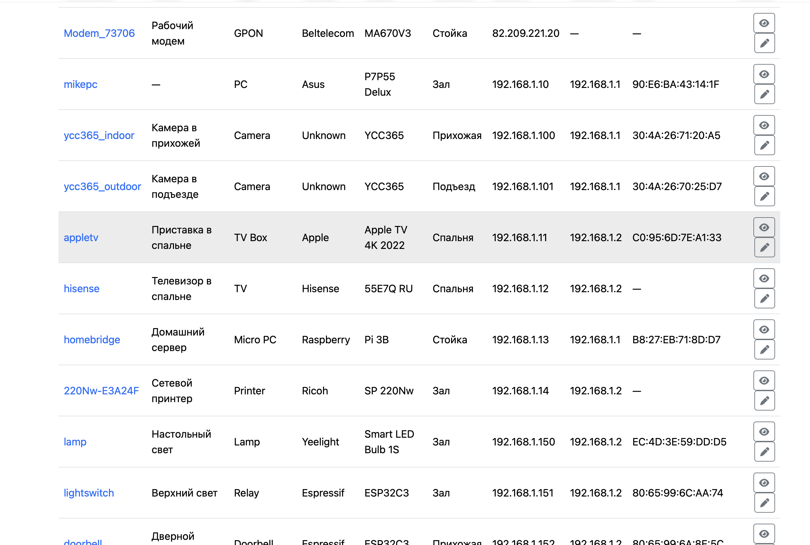
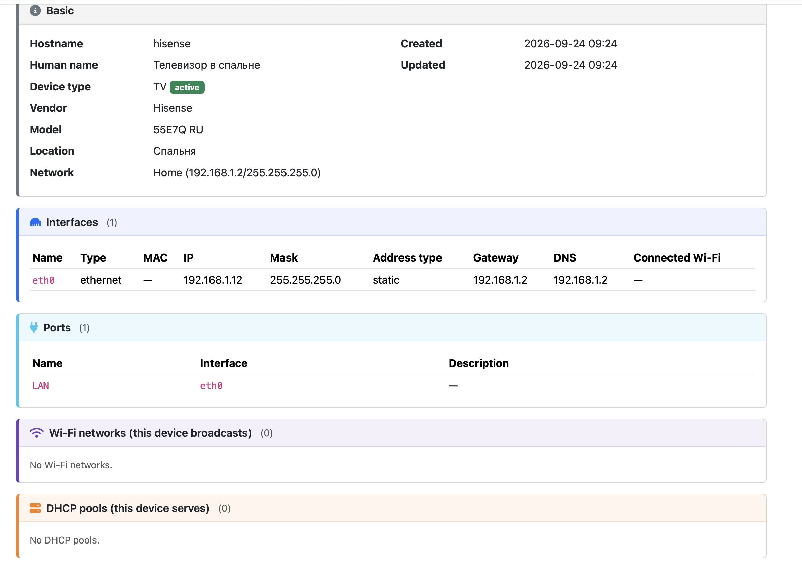
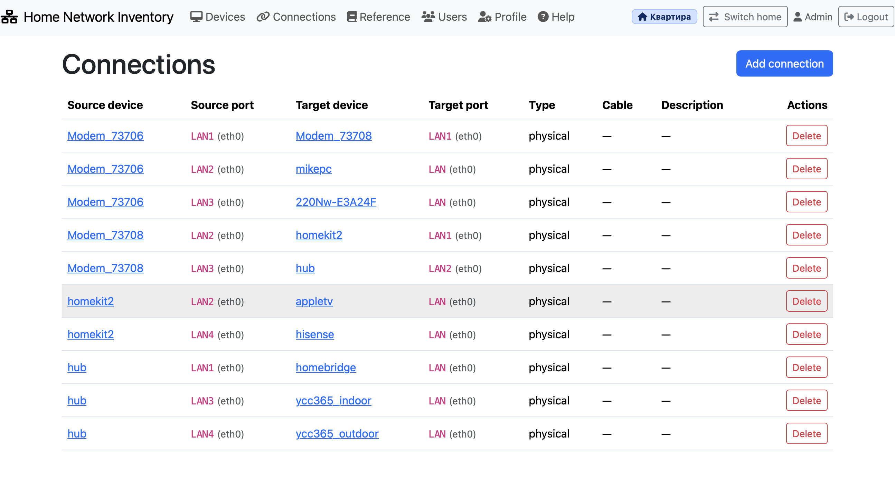

# Home Network Inventory

A self-hosted web application for tracking devices on a home network. It stores
information about devices, their network interfaces, IP addresses, Wi-Fi
networks, physical ports, credentials, services, and connections between
devices.

Supports **multiple homes** — an apartment, a country house, an office — each
with its own isolated inventory.

Designed to be simple enough for a home lab, but structured enough to keep the
inventory clean and searchable.

> Early but stable. Works well for home use. Feedback and contributions are
> welcome.

---

## Features

- **Multiple homes** — every home has its own devices, networks, locations,
  and connections. Users see only the homes they are assigned to.
  - Home cards with optional photo and address
  - Admin-only creation, editing, and deletion
  - Per-user assignment
  - Delete a home only when it is empty
- **Devices** — full inventory with a colour-coded device page:
  - basic info (hostname, type, vendor, model, location, network)
  - network interfaces (Ethernet, Wi-Fi, WAN, virtual, physical ports)
  - IP addresses with four address types: `static`, `dhcp`, `reserved`, `external`
  - physical ports (WAN, LAN1, LAN2, …) mapped to interfaces
  - Wi-Fi networks the device broadcasts (SSID, band, encryption, password)
  - DHCP pools the device serves
  - credentials (admin, ssh, wifi, camera, matter, other)
  - services (web UI, RTSP streams, HomeBridge, etc.)
  - free-form remarks
- **Connections** — physical and logical links between device ports, with
  cable colour/type and description. Bidirectional: a connection shows up on
  both device pages. Cross-home links are not permitted.
- **Reference** — locations and networks per home, editable by any user with
  `Can edit`. Global lists (device types, vendors, models, credential types)
  are shared across all homes and can only be changed by admins. Full CRUD
  with reference-integrity checks.
- **Users** — multi-user with three independent permission flags for
  non-admin users:
  - `Can edit` — create, edit, delete devices and connections
  - `Can view passwords` — see device passwords
  - `Can change passwords` — change existing device passwords
- **Profile** — per-user language (English / Russian) and theme
  (Auto / Light / Dark).
- **Help** — built-in guide with a table of contents, in English and Russian.

## Screenshots

### Devices list



### Device page



### Connections



More screenshots are in [`docs/screenshots/`](docs/screenshots/).

## Tech stack

- **Backend**: Python 3.11+, FastAPI, SQLAlchemy 2.x, Pydantic v2
- **Database**: SQLite
- **Templating**: Jinja2
- **Frontend**: Bootstrap 5 (CDN), Font Awesome 6 (CDN), vanilla JS
- **Server**: Uvicorn
- **Sessions**: signed cookie via `itsdangerous` and Starlette's `SessionMiddleware`
- **Auth**: bcrypt password hashing for application users; device passwords are
  stored in plain text (by design — they need to be readable in the UI)

No frontend build step. No Node.js. No JavaScript framework.

## Requirements

- Python 3.11 or newer
- A Linux server (Raspberry Pi, VPS, home server — anything)
- Optional: nginx in front for HTTPS and a nicer domain

## Installation

### Quick start (development)

```bash
git clone https://github.com/<you>/HomeNetworkInventory.git
cd HomeNetworkInventory

python3 -m venv venv
source venv/bin/activate

pip install -r requirements.txt

# Edit app/config.py and change session_secret to a random value
python -c "import secrets; print(secrets.token_urlsafe(48))"

python run.py
```

Open `http://127.0.0.1:8420/` in your browser. The default credentials are
`Admin` / `Admin`, and you will be forced to change the password on first
sign-in.

The SQLite database file `home_network.db` is created automatically on first
start, in the project root.

On first sign-in as admin, create your first home, then start adding devices.

### Production deployment

See [`docs/DEPLOYMENT.md`](docs/DEPLOYMENT.md) for a step-by-step guide for
running the application behind nginx with a systemd service and Let's Encrypt
TLS. Example configuration files are in [`docs/`](docs/).

## Configuration

All configuration lives in [`app/config.py`](app/config.py). The most important
values:

| Setting | Description |
|---|---|
| `app_host` / `app_port` | Bind address and port for Uvicorn. Default `127.0.0.1:8420`. |
| `database_url` | SQLAlchemy database URL. Default `sqlite:///./home_network.db` (file next to the app). |
| `session_secret` | Random string used to sign session cookies. **Change this before deploying.** |
| `session_timeout_seconds` | Session inactivity timeout in seconds. Default 2 hours. |

To generate a strong `session_secret`:

```bash
python -c "import secrets; print(secrets.token_urlsafe(48))"
```

## First run

1. Start the application.
2. Open the login page.
3. Sign in with `Admin` / `Admin`.
4. You will be forced to change the password.
5. Create your first home on the **Choose a home** page.
6. Inside the home, populate **Reference** — locations and networks. Add
   global reference data once (device types, vendors, models, credential
   types) — it is shared across all homes.
7. Start adding devices.

## Project structure

```
HomeNetworkInventory/
├── app/
│   ├── main.py             # FastAPI entry point
│   ├── config.py           # Settings (host, port, DB URL, session secret)
│   ├── database.py         # SQLAlchemy engine, session, Base
│   ├── core/               # Cross-cutting utilities
│   │   ├── bootstrap.py    # Creates the default Admin user on first run
│   │   ├── deps.py         # FastAPI dependencies (current_user, require_site, …)
│   │   ├── exceptions.py   # ValidationError
│   │   ├── i18n.py         # Language detection and translation
│   │   ├── middleware.py   # CurrentSiteMiddleware
│   │   ├── security.py     # bcrypt hashing
│   │   ├── templating.py   # Jinja2 render helper
│   │   └── validation.py   # IP, MAC, hostname validators
│   ├── models/             # SQLAlchemy models (one file per entity)
│   ├── schemas/            # Pydantic schemas (reserved for future use)
│   ├── crud/               # Database operations with validation
│   ├── routers/            # HTTP endpoints (auth, sites, devices, …)
│   ├── templates/          # Jinja2 templates
│   ├── static/             # CSS and JS
│   └── locales/            # Translation files (en.json, ru.json)
├── docs/                   # Deployment guide, example configs, screenshots
├── requirements.txt
├── run.py                  # Convenience launcher for development
└── LICENSE
```

## Security model

- Application user passwords are hashed with **bcrypt**.
- Sessions are signed cookies; the payload is not encrypted, but it cannot be
  tampered with without the `session_secret`. Only `user_id` and `last_seen`
  are stored.
- Device passwords (Wi-Fi, credentials, RTSP URLs) are stored **in plain text**
  and displayed in the UI. This is intentional: the tool is meant to be a
  living inventory, and hiding passwords behind yet another password would
  defeat the purpose. Do not expose this application to the public internet
  without strong authentication in front.
- Access control is enforced by three permission flags per non-admin user
  (see above) and by per-home assignment: a user only sees the homes they
  have been assigned to.
- Passwords of devices are never sent to the browser for users who lack the
  `Can view passwords` permission — the fields are rendered empty and disabled.

## Contributing

Issues and pull requests are welcome. For larger changes, please open an issue
first so we can discuss the approach.

## License

Licensed under the **GNU Affero General Public License v3.0**. See
[LICENSE](LICENSE) for the full text.

Copyright (C) 2026 Mike Petrichenko

